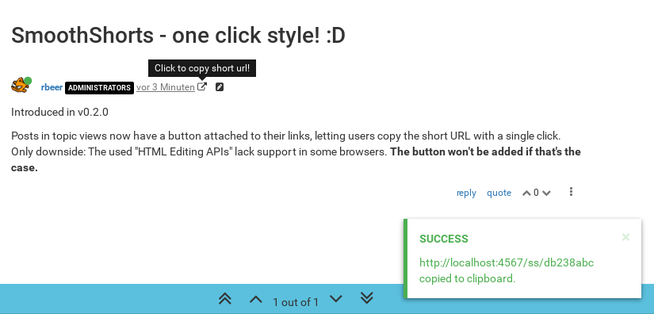

# nodebb-plugin-smoothshorts

### Seamless short URL plugin for NodeBB
Nobody likes itchy pants, do you? Neither do I. :smirk:

That's why these shorts are seamlessly woven into the NodeBB experience, your users won't feel a thing.

## Installation
1. `npm install nodebb-plugin-smoothshorts`

2. Activate the plugin in ACP/Extend/Plugins.

3. Setup plugin (and hash already existing posts/topics) in ACP/Plugins/SmoothShorts.

4. Go click 'em! :D

## Features

### One-click button

Given that the client's browser supports the [execCommand](https://developer.mozilla.org/en-US/docs/Web/API/Document/execCommand "execCommand documentation at MDN")('copy'), SmoothShorts will add an icon next to post links, which copies the short URL with a single click. The [context menu](#context-menu) method is always available.

**NOTE**: If you are using NodeBB >=1.0.0, you have a more suitable icon `fa-hashtag` available. The plugin's default `fa-external-link` ensures backwards compatibility. You can change the icon class in the template ([copybutton.tpl](public/templates/smoothshorts/copybutton.tpl)).

### Context menu

Once a user opens the browser's context menu upon a topic link, the href value of that link gets replaced with its assigned hash:

This also works on posts:

(not all themes have those links; posts are hashed, regardless of used theme)

The now copied address is of the form `https://yourNodeBB.org/ss/HASH`. Visiting it will redirect to the associated post or topic:

## Settings (ACP/Plugins/SmoothShorts)

###- Modifier key
  
  Users would have to press Ctrl/Alt/Shift while opening the context menu in order to replace the link;
###- Forced domain

  Short urls are forced onto this domain, disregarding which the user chose to visit the board.

## Q/A & Known Issues
###Why not use a service like bit.ly or goo.gl?
##### Coming in 0.3.0!

~~For two reasons:~~

~~1. While investigating bit.ly, I noticed that they impose limits on calls to their API. No need to hate them for it; in fact, they have every right to do so, protecting themselves against bots and such. But unfortunately, as hashing is triggered by every user creating a topic/post, a single spam attack on your NodeBB could make you run out of those API calls; just like that.~~

~~2. Links to posts in NodeBB are not structured like /topic/topicslug/*postID*, but rather /topic/topicslug/*positionInTopic*. Which means that if you purge a post, your already created short urls would get all mixed up.~~
